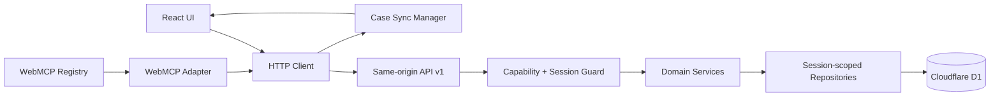

# Returns Desk API 与 WebMCP 详细契约

## 1. 文档目的

本文定义 Returns Desk 的同源 HTTP API、六个 WebMCP 工具、统一错误模型、幂等与并发规则、浏览器注册生命周期，以及工具调用后的 UI 同步机制。HTTP API 与 WebMCP 只作为适配层，授权、校验、政策判断和状态转换均由同一领域服务完成。

契约版本为 `v1`。破坏性变更必须创建新版本；增加可选字段不视为破坏性变更。

## 2. Spike 结论与约束

2026-08-29 在 Chrome 151 headed、真实 `http://127.0.0.1` 来源和 WebMCP 实验特性下验证：

- `document.modelContext.registerTool()` 可注册并通过 `getTools()` 发现六个工具；
- `readOnlyHint` 与 `untrustedContentHint` 可被发现端读取；
- 注册时传入的 `AbortSignal` 中止后，工具从注册表移除并触发 `toolchange`；
- 写工具返回实体版本后，重新读取 Case 可以可靠更新同页 UI；
- 调用方取消会拒绝 `executeTool()`，但 Chrome 151 的 `execute` 回调没有观察到 signal abort；
- headless Chrome 151 未完成异步注册流程，因此原生发布验收使用 headed 浏览器。

由此确定：

1. 以最新 WebMCP Community Group Draft 的 `document.modelContext` 为主入口，不使用已废弃的 `provideContext`、`clearContext` 或按名称注销。
2. 注册生命周期与执行生命周期使用不同的 `AbortController`。
3. 执行取消为尽力而为的资源优化，不承担幂等、回滚或事务正确性。
4. WebMCP 不可用时，UI 和 HTTP API 保持完整功能；页面只是不注册 Agent 工具。
5. UI 同步以服务端实体版本和重新读取为准，浏览器内事件只作刷新提示。

Spike 可丢弃探针位于 `spikes/webmcp/`，不得被产品代码引用。

## 3. 统一服务边界



- WebMCP `execute` 不包含业务规则，只校验基本形状、调用 HTTP Client、压缩结果并请求 UI 同步。
- HTTP 路由不依据客户端提供的 `actorType` 授权。路由自身声明所需能力，服务端从会话与调用入口生成审计 actor。
- `human` 专属路由要求同源 Session、CSRF 和显式确认载荷；`agent` 路由永远不能调用批准、拒绝、资格人工复核、替换、Reset 或政策写入服务。
- Repository 的每次实体读写都包含 `session_id`，跨 Session 与不存在统一返回 404。

## 4. HTTP 通用约定

### 4.1 基础格式

- 基础路径：`/api/v1`
- 内容类型：`application/json; charset=utf-8`
- 字段命名：HTTP JSON 和 WebMCP 均使用 `camelCase`；数据库内部使用 `snake_case`。
- ID：不透明、区分实体类型的字符串，最长 64 字符；客户端不得解析 ID。
- 金额：整数分，字段后缀 `Cents`，同时携带三位大写币种。
- 时间：UTC RFC 3339 字符串。
- 未声明字段：请求一律拒绝；响应消费者必须忽略未来新增的可选字段。
- 列表：游标分页，`limit` 默认 20、最大 50；订单搜索固定最大 5。

### 4.2 成功响应

```json
{
  "data": {},
  "meta": {
    "requestId": "req_01...",
    "serverTime": "2026-08-29T07:00:00Z",
    "seedVersion": 3
  },
  "effects": [
    {
      "entityType": "return_case",
      "entityId": "case_01...",
      "entityVersion": 7,
      "caseId": "case_01..."
    }
  ]
}
```

只读请求可以省略 `effects`。写入已提交但 UI 刷新失败时，HTTP 响应仍是成功；WebMCP 适配器单独返回 `uiSync = refresh_required`。

### 4.3 错误响应

```json
{
  "error": {
    "code": "PENDING_PROPOSAL_CONFLICT",
    "message": "This case already has a pending proposal.",
    "retryable": false,
    "correlationId": "corr_01...",
    "currentState": "pending",
    "recoveryAction": "open_existing_proposal",
    "fieldErrors": []
  },
  "meta": {
    "requestId": "req_01...",
    "serverTime": "2026-08-29T07:00:00Z",
    "seedVersion": 3
  }
}
```

`message` 是安全、稳定、可本地化的摘要，不包含堆栈、SQL、Cookie、内部路径或其他 Session 的存在性。

### 4.4 HTTP 状态映射

| HTTP | 使用场景 |
|---|---|
| `200` | 成功读取、幂等重放、成功命令 |
| `201` | 新建 Case、资格快照、提案或政策草稿 |
| `400` | JSON、Schema、枚举或字段格式错误 |
| `401` | Demo Session 缺失或失效 |
| `403` | CSRF、Origin 或能力不足 |
| `404` | 实体不存在或不属于当前 Session |
| `409` | 版本、状态、幂等键、pending 提案或业务事实冲突 |
| `422` | 形状合法但领域前置条件不满足 |
| `429` | 限流 |
| `500` | 未分类内部错误 |
| `503` | D1 或依赖暂时不可用 |

### 4.5 幂等、版本和取消

- 所有业务写请求携带 `Idempotency-Key`，1–128 个 ASCII 字符；同键同规范化载荷返回原结果，同键不同载荷返回 `IDEMPOTENCY_KEY_REUSED`。
- 可变聚合返回整数 `version`。基于旧页面的人工写请求必须提交 `expectedVersion`；不匹配返回 `ENTITY_VERSION_CONFLICT`。
- 所有写请求提交 `expectedSeedVersion`；Reset 后旧请求返回 `DEMO_SESSION_RESET`。
- HTTP Client 把执行期 `AbortSignal` 传给 `fetch`。事务提交开始后，客户端取消不能推断失败；重试必须使用同一幂等键读取确定结果。
- 服务端设置请求和事务超时。即使 Chrome 未把执行取消传播给回调，数据库不变量仍由幂等、条件更新、唯一约束和事务保证。

## 5. 权限与请求头

| 路由类别 | Session Cookie | CSRF + Origin | 幂等键 | WebMCP 可调用 |
|---|---:|---:|---:|---:|
| GET 读取 | 是 | 否 | 否 | 允许的读取能力 |
| Agent 安全计算 POST | 是 | 是 | 按路由 | 是 |
| 提交 pending 提案 | 是 | 是 | 是 | 是 |
| 人工资格复核/审批/拒绝/替换 | 是 | 是 | 是 | 否 |
| Reset/政策写入 | 是 | 是 | 是 | 否 |

写请求头：

- `X-CSRF-Token`：来自同源 bootstrap，绑定当前 Session；
- `Idempotency-Key`：业务命令唯一键；
- `X-Request-ID`：可选客户端诊断 ID，不作为授权依据。

WebMCP 适配器可以从同源应用内存读取 CSRF token，但不能读取 HttpOnly Session Cookie；Cookie 由浏览器随同源请求自动携带。客户端自报 `X-Actor-Channel` 只可用于诊断，服务端不据此提升权限。

WebMCP 写工具把输入中的 `idempotencyKey` 提升为 HTTP `Idempotency-Key` 请求头，并从 Session bootstrap 注入 `expectedSeedVersion`；Agent 不负责读取 CSRF 或维护 seedVersion。

## 6. HTTP 路由清单

### 6.1 Session、Dashboard 与读取

| 方法与路由 | 能力 | 说明 |
|---|---|---|
| `GET /session/bootstrap` | session.read | 初始化/读取当前 Demo Session、CSRF、seedVersion 和能力摘要 |
| `POST /session/reset` | demo.reset.human | 仅重建当前 Session seed，轮换 CSRF |
| `GET /dashboard` | dashboard.read | 运营摘要 |
| `GET /orders?query=&limit=5` | orders.search | 订单号、姓名或邮箱搜索 |
| `GET /orders/{orderId}` | orders.read | 订单与订单行详情 |
| `GET /order-items/{orderItemId}/return-policy` | policy.read | 锁定政策版本与安全摘要 |
| `GET /cases?status=&cursor=&limit=` | cases.read | Case 列表 |
| `GET /cases/{caseId}` | cases.read | Case Workspace 聚合视图与 `version` |
| `GET /cases/{caseId}/activity?cursor=&limit=` | audit.read | 安全时间线 |
| `GET /approval-queue?type=&cursor=&limit=` | approvals.read.human | pending 提案或资格复核队列 |

### 6.2 Case、资格、方案和消息

| 方法与路由 | 能力 | 说明 |
|---|---|---|
| `POST /cases` | cases.create | 人工创建 Case；Agent 检查资格时也可由领域服务 get-or-create |
| `POST /eligibility-checks` | eligibility.check | 创建不可变资格快照，可能创建 Case |
| `POST /eligibility-checks/{checkId}/compare-resolutions` | resolutions.compare | 只计算排序与解释，不持久化业务结果 |
| `POST /message-drafts` | messages.draft | 受控模板生成，不持久化草稿 |
| `POST /eligibility-checks/{checkId}/reviews` | eligibility.review.human | 创建人工复核子快照 |

### 6.3 RMA 提案与人工审批

| 方法与路由 | 能力 | 说明 |
|---|---|---|
| `POST /rma-proposals` | proposal.submit | 仅创建 `pending` 提案 |
| `GET /rma-proposals/{proposalId}` | proposals.read | 读取时执行惰性过期 |
| `POST /rma-proposals/{proposalId}/approve` | proposal.approve.human | 单事务创建 completed RMA 和模拟副作用 |
| `POST /rma-proposals/{proposalId}/reject` | proposal.reject.human | 人工拒绝 |
| `POST /rma-proposals/{proposalId}/replace` | proposal.replace.human | 单事务 supersede 旧提案并创建新提案 |

### 6.4 政策管理

| 方法与路由 | 能力 | 说明 |
|---|---|---|
| `GET /policy-versions?status=&cursor=&limit=` | policy.read | 政策列表 |
| `GET /policy-versions/{policyVersionId}` | policy.read | 版本详情 |
| `POST /policy-versions` | policy.write.human | 创建 draft |
| `PATCH /policy-versions/{policyVersionId}` | policy.write.human | 仅修改 draft，要求 expectedVersion |
| `POST /policy-versions/{policyVersionId}/validate` | policy.write.human | 结构与冲突预检，不激活 |
| `POST /policy-versions/{policyVersionId}/activate` | policy.activate.human | 激活 draft、retire 原 active |

## 7. 公共枚举与结构

### 7.1 业务枚举

- `reasonCode`：`changed_mind`、`wrong_size`、`damaged`、`wrong_item`、`not_as_described`
- `conditionCode`：`unopened`、`opened_unused`、`used`、`damaged`
- `resolutionType`：`exchange`、`refund`、`store_credit`
- `eligibilityStatus`：`eligible`、`ineligible`、`needs_review`
- `proposalStatus`：`pending`、`approved`、`rejected`、`expired`、`superseded`、`invalidated`
- `rmaStatus`：MVP 仅 `completed`

### 7.2 `CaseSyncRef`

```json
{
  "caseId": "case_01...",
  "caseVersion": 7,
  "affectedEntityIds": ["check_01..."],
  "uiSync": "synchronized"
}
```

`uiSync` 由 WebMCP 适配器添加，取值为 `synchronized` 或 `refresh_required`，不是服务端业务状态。

### 7.3 `ResolutionOption`

```json
{
  "type": "exchange",
  "customerOutcome": "Replacement SKU BLUE-M",
  "merchantCostCents": 1800,
  "currency": "USD",
  "returnRequired": true,
  "replacementVariantId": "var_01...",
  "inventoryAvailable": 4,
  "customerConsentRequired": false,
  "recommendationReasons": ["IN_STOCK", "LOWER_MERCHANT_COST"]
}
```

仅与方案相关的字段出现；金额和库存均来自服务端事实。

## 8. WebMCP 工具总表

| 工具 | 领域能力 | `readOnlyHint` | `untrustedContentHint` | 持久化业务状态 |
|---|---|---:|---:|---|
| `search_orders` | orders.search | true | true | 否，仅安全审计 |
| `get_return_policy` | policy.read | true | false | 否，仅安全审计 |
| `check_return_eligibility` | eligibility.check | false | true | 是，Case/资格快照 |
| `compare_resolution_options` | resolutions.compare | true | false | 否，仅安全审计 |
| `draft_customer_message` | messages.draft | true | true | 否 |
| `submit_rma_for_approval` | proposal.submit | false | true | 是，pending 提案 |

`check_return_eligibility` 不能标记只读，因为它创建领域快照。审计/遥测写入不改变其他四个读取/计算工具的只读业务语义。

## 9. 逐工具输入与输出契约

所有输入 Schema 均使用 JSON Schema 2020-12 可移植子集，根对象设置 `additionalProperties: false`。浏览器 Schema 只用于发现和引导；服务端重复执行严格校验。

### 9.1 `search_orders`

用途：按订单号、客户姓名或邮箱查找，最多返回 5 条；多结果不能默认选择第一条。

```json
{
  "type": "object",
  "additionalProperties": false,
  "properties": {
    "query": { "type": "string", "minLength": 2, "maxLength": 120 },
    "limit": { "type": "integer", "minimum": 1, "maximum": 5, "default": 5 }
  },
  "required": ["query"]
}
```

成功输出：

```json
{
  "orders": [
    {
      "orderId": "ord_01...",
      "orderNumber": "#1042",
      "customerDisplayName": "Ava L.",
      "maskedEmail": "a***@example.com",
      "deliveredAt": "2026-08-20T10:00:00Z",
      "matchedBy": "order_number"
    }
  ],
  "resultCount": 1,
  "requiresSelection": false
}
```

主要错误：`INVALID_SEARCH_QUERY`、`RATE_LIMITED`、`SESSION_EXPIRED`。

### 9.2 `get_return_policy`

用途：读取订单行锁定的政策版本；不得使用当前 active 政策替换历史锁定版本。

```json
{
  "type": "object",
  "additionalProperties": false,
  "properties": {
    "orderId": { "type": "string", "minLength": 1, "maxLength": 64 },
    "orderItemId": { "type": "string", "minLength": 1, "maxLength": 64 }
  },
  "required": ["orderId", "orderItemId"]
}
```

成功输出：

```json
{
  "policyVersionId": "polv_01...",
  "name": "Standard returns v3",
  "lockedToOrderItem": true,
  "defaultWindowDays": 30,
  "absoluteMaxWindowDays": 60,
  "defaultReturnRequired": true,
  "returnShippingPayer": "merchant",
  "supportedResolutions": ["exchange", "refund", "store_credit"],
  "ruleSummary": ["Final sale restrictions apply", "Damage exceptions require review"]
}
```

主要错误：`ORDER_ITEM_NOT_FOUND`、`ORDER_ITEM_RELATION_MISMATCH`、`POLICY_VERSION_NOT_FOUND`。

### 9.3 `check_return_eligibility`

用途：确定性计算并保存不可变资格快照。未提供 `caseId` 时，领域服务按本次售后事实创建 Case；提供时必须校验 Case、订单和订单行关系。

```json
{
  "type": "object",
  "additionalProperties": false,
  "properties": {
    "caseId": { "type": "string", "minLength": 1, "maxLength": 64 },
    "orderId": { "type": "string", "minLength": 1, "maxLength": 64 },
    "orderItemId": { "type": "string", "minLength": 1, "maxLength": 64 },
    "requestedQuantity": { "type": "integer", "minimum": 1, "maximum": 100 },
    "reasonCode": { "type": "string", "enum": ["changed_mind", "wrong_size", "damaged", "wrong_item", "not_as_described"] },
    "conditionCode": { "type": "string", "enum": ["unopened", "opened_unused", "used", "damaged"] },
    "replacementVariantId": { "type": "string", "minLength": 1, "maxLength": 64 },
    "storeCreditConsent": { "type": "boolean" },
    "customerNote": { "type": "string", "maxLength": 1000 },
    "idempotencyKey": { "type": "string", "minLength": 1, "maxLength": 128, "pattern": "^[A-Za-z0-9._:-]+$" }
  },
  "required": ["orderId", "orderItemId", "requestedQuantity", "reasonCode", "conditionCode", "idempotencyKey"]
}
```

成功输出：

```json
{
  "eligibilityCheckId": "check_01...",
  "caseId": "case_01...",
  "status": "eligible",
  "expiresAt": "2026-08-29T07:15:00Z",
  "policyVersionId": "polv_01...",
  "requestedQuantity": 1,
  "remainingReturnableQuantity": 1,
  "allowedResolutions": [
    {
      "type": "refund",
      "customerOutcome": "Refund to original payment method",
      "merchantCostCents": 7900,
      "currency": "USD",
      "returnRequired": true,
      "customerConsentRequired": false,
      "recommendationReasons": ["ORIGINAL_PAYMENT_AVAILABLE"]
    }
  ],
  "returnRequired": true,
  "returnShippingPayer": "merchant",
  "reasonCodes": ["WITHIN_RETURN_WINDOW"],
  "matchedRules": [
    { "ruleId": "rule_01...", "layer": 4, "effect": "return_window", "explanation": "Within 30-day window" }
  ],
  "missingInformation": [],
  "caseSync": { "caseId": "case_01...", "caseVersion": 3, "affectedEntityIds": ["check_01..."], "uiSync": "synchronized" }
}
```

`ineligible` 和 `needs_review` 仍返回 200/201 的确定性业务结果，不作为技术错误；只有 `eligible` 可以提交提案。

主要错误：`INVALID_ELIGIBILITY_INPUT`、`ORDER_NOT_DELIVERED` 之外的形状/关系错误、`CASE_RELATION_MISMATCH`、`DEMO_SESSION_RESET`。政策结果原因码沿用《政策规则与资格判定》。

### 9.4 `compare_resolution_options`

用途：排序并解释资格快照已有方案，不增加方案、不修改金额、不重新判定资格。

```json
{
  "type": "object",
  "additionalProperties": false,
  "properties": {
    "eligibilityCheckId": { "type": "string", "minLength": 1, "maxLength": 64 },
    "preference": { "type": "string", "enum": ["customer_value", "merchant_cost", "fastest_resolution"], "default": "customer_value" }
  },
  "required": ["eligibilityCheckId"]
}
```

成功输出：

```json
{
  "eligibilityCheckId": "check_01...",
  "status": "eligible",
  "options": [],
  "recommendedResolution": "exchange",
  "recommendationReasons": ["CUSTOMER_PREFERENCE_MATCH", "IN_STOCK"]
}
```

主要错误：`ELIGIBILITY_CHECK_NOT_FOUND`、`ELIGIBILITY_CHECK_STALE`、`ELIGIBILITY_NOT_ELIGIBLE`。

### 9.5 `draft_customer_message`

用途：使用受控模板和已确认事实生成纯文本草稿；草稿不持久化，不能发送邮件。

```json
{
  "type": "object",
  "additionalProperties": false,
  "properties": {
    "caseId": { "type": "string", "minLength": 1, "maxLength": 64 },
    "eligibilityCheckId": { "type": "string", "minLength": 1, "maxLength": 64 },
    "resolutionType": { "type": "string", "enum": ["exchange", "refund", "store_credit"] },
    "replacementVariantId": { "type": "string", "minLength": 1, "maxLength": 64 },
    "tone": { "type": "string", "enum": ["concise", "warm", "apologetic"], "default": "warm" },
    "locale": { "type": "string", "enum": ["en-US", "zh-CN"] }
  },
  "required": ["caseId", "eligibilityCheckId", "resolutionType", "locale"]
}
```

成功输出：

```json
{
  "subject": "Your return request for order #1042",
  "bodyText": "...",
  "factsUsed": ["ORDER_NUMBER", "RESOLUTION", "RETURN_REQUIRED"],
  "missingInformation": [],
  "sendStatus": "not_sent"
}
```

`missingInformation` 非空时 `bodyText` 可以为空，工具不得补写未知事实。主要错误：`RESOLUTION_NOT_ALLOWED`、`ELIGIBILITY_CHECK_STALE`、`CASE_RELATION_MISMATCH`。

### 9.6 `submit_rma_for_approval`

用途：保存审批快照并创建 `pending` 提案；明确不执行退款、库存扣减、余额、标签或邮件发送。

```json
{
  "type": "object",
  "additionalProperties": false,
  "properties": {
    "caseId": { "type": "string", "minLength": 1, "maxLength": 64 },
    "eligibilityCheckId": { "type": "string", "minLength": 1, "maxLength": 64 },
    "resolutionType": { "type": "string", "enum": ["exchange", "refund", "store_credit"] },
    "replacementVariantId": { "type": "string", "minLength": 1, "maxLength": 64 },
    "customerMessage": {
      "type": "object",
      "additionalProperties": false,
      "properties": {
        "subject": { "type": "string", "minLength": 1, "maxLength": 160 },
        "bodyText": { "type": "string", "minLength": 1, "maxLength": 4000 },
        "locale": { "type": "string", "enum": ["en-US", "zh-CN"] }
      },
      "required": ["subject", "bodyText", "locale"]
    },
    "idempotencyKey": { "type": "string", "minLength": 1, "maxLength": 128, "pattern": "^[A-Za-z0-9._:-]+$" }
  },
  "required": ["caseId", "eligibilityCheckId", "resolutionType", "customerMessage", "idempotencyKey"]
}
```

成功输出：

```json
{
  "proposalId": "prop_01...",
  "caseId": "case_01...",
  "status": "pending",
  "resolutionType": "refund",
  "requestedQuantity": 1,
  "amountCents": 7900,
  "currency": "USD",
  "returnRequired": true,
  "expiresAt": "2026-08-29T08:00:00Z",
  "executedEffects": [],
  "nextAction": "human_review_required",
  "caseSync": { "caseId": "case_01...", "caseVersion": 4, "affectedEntityIds": ["prop_01..."], "uiSync": "synchronized" }
}
```

主要错误：`ELIGIBILITY_CHECK_STALE`、`ELIGIBILITY_NOT_ELIGIBLE`、`RESOLUTION_NOT_ALLOWED`、`CUSTOMER_CONSENT_REQUIRED`、`PENDING_PROPOSAL_CONFLICT`、`IDEMPOTENCY_KEY_REUSED`、`DEMO_SESSION_RESET`。

## 10. 人工命令契约

这些命令只存在于 HTTP API 和领域服务，不注册为 WebMCP 工具。

### 10.1 人工资格复核

请求：`reviewResult` 为 `eligible_exception_approved`、`ineligible_exception_denied` 或 `insufficient_evidence`，并携带 `reasonCode`、可选纯文本 `note`、`expectedSeedVersion` 和父检查 ID。成功创建新的不可变子快照并返回 Case effect。

### 10.2 批准提案

请求包含 `expectedVersion`、`expectedSeedVersion`、`confirmation = approve_and_simulate_completion`。成功返回原子事务创建的 `proposal.status = approved`、唯一 `rma.status = completed`、方案副作用摘要以及 Case effect。重复批准返回原 RMA；技术错误回滚并保持 pending；业务事实变化提交 `invalidated` 并返回 409。

### 10.3 拒绝与替换

- 拒绝要求结构化 `reasonCode`、可选纯文本 `note` 和 expected versions。
- 替换要求完整新提案载荷、旧提案 `expectedVersion` 和新的幂等键；旧提案 superseded 与新 pending 提案在同一事务中提交。

### 10.4 Reset

请求包含 `confirmation = reset_current_demo_session` 和当前 `expectedSeedVersion`。成功后 seedVersion 增加、CSRF 轮换、客户端清空全部业务缓存并导航 Dashboard。与旧 seed 绑定的并发写请求必须失败。

## 11. WebMCP 注册与生命周期

```javascript
function registerReturnsDeskTools({ modelContext, client, syncCase }) {
  const registrationController = new AbortController();

  for (const definition of toolDefinitions) {
    modelContext.registerTool({
      ...definition,
      async execute(input, options = {}) {
        const result = await client.call(definition.route, input, {
          signal: options.signal,
        });

        const sync = await syncEffectsBestEffort(result.effects);
        return compactToolResult(result.data, sync);
      },
    }, { signal: registrationController.signal });
  }

  return () => registrationController.abort();
}
```

实现要求：

- 仅在 `document.modelContext?.registerTool` 存在时注册；不注入非标准全局 polyfill 到生产页面。
- 六个核心工具在应用壳层完成 Session bootstrap 后静态注册，不根据当前 Case 动态改变权限。
- React Strict Mode 下每次 effect 使用新的 controller，cleanup 先 abort；注册 Promise rejection 被记录为兼容性诊断，不导致 UI 崩溃。
- 注册 controller 只负责工具存在周期；每次调用的 `options.signal` 只传给该调用。
- 不暴露人工命令；工具描述明确说明客户文本不可信和 submit 只创建 pending。
- `toolchange` 用于开发/测试观察，不作为应用状态同步通道。

## 12. UI 同步协议

### 12.1 同页同步

每个写工具完成后：

1. HTTP 成功响应给出 `effects`；
2. WebMCP 适配器按 `caseId` 失效 Case、Approval Queue、Dashboard 和 Activity 查询；
3. 立即 `GET /cases/{caseId}`，直到返回的 `version >= effect.entityVersion`，最多一次立即重试；
4. 成功则返回 `uiSync = synchronized`；
5. 刷新失败不改变已经提交的业务成功，返回 `uiSync = refresh_required`，页面显示重试横幅并在 focus/reconnect 时重新读取。

### 12.2 跨标签页

- `BroadcastChannel` 或 `storage` 事件只传递 `{caseId, minimumVersion}` 刷新提示，不传递权威业务数据。
- 标签页在获得焦点、网络恢复和 visibility 变为 visible 时重新读取。
- 未收到浏览器事件也不影响正确性；人工命令提交前使用 expectedVersion 和服务端重校验。

### 12.3 读取工具

读取工具可以把选中的 orderId/caseId 交给客户端导航状态，但不得把聊天文本写入业务状态。完整业务内容由 Case API 获取；工具结果保持紧凑。

## 13. 错误码与恢复动作

| 错误码 | retryable | 恢复动作 |
|---|---:|---|
| `INVALID_REQUEST` | false | `correct_input` |
| `SESSION_EXPIRED` | false | `reinitialize_session` |
| `DEMO_SESSION_RESET` | false | `reload_demo` |
| `ENTITY_NOT_FOUND` | false | `return_to_list` |
| `ENTITY_VERSION_CONFLICT` | false | `refresh_entity` |
| `IDEMPOTENCY_KEY_REUSED` | false | `generate_new_key_after_review` |
| `RATE_LIMITED` | true | `retry_after` |
| `DEPENDENCY_UNAVAILABLE` | true | `retry_same_idempotency_key` |
| `ELIGIBILITY_CHECK_STALE` | false | `rerun_eligibility` |
| `ELIGIBILITY_NOT_ELIGIBLE` | false | `review_eligibility` |
| `MANUAL_REVIEW_REQUIRED` | false | `open_eligibility_review` |
| `RESOLUTION_NOT_ALLOWED` | false | `compare_allowed_resolutions` |
| `CUSTOMER_CONSENT_REQUIRED` | false | `obtain_customer_consent` |
| `PENDING_PROPOSAL_CONFLICT` | false | `open_existing_proposal` |
| `PROPOSAL_EXPIRED` | false | `rerun_eligibility` |
| `PROPOSAL_INVALIDATED` | false | `rerun_eligibility` |
| `PROPOSAL_NOT_PENDING` | false | `refresh_proposal` |
| `EXCHANGE_INVENTORY_UNAVAILABLE` | false | `rerun_eligibility` |

未分类错误对 Agent 只返回安全摘要和 correlationId。WebMCP `execute` 对结构化业务错误返回可机器读取的失败对象；只在注册失败、网络中断或无法解析响应时 reject。

## 14. 契约验证门槛

- 六工具注册快照与本文一致，人工能力不存在。
- 每个输入 Schema 有有效、边界、未知字段、错误枚举和超长 fixture。
- `check_return_eligibility` 与 `submit_rma_for_approval` 的 `readOnlyHint` 必须为 false。
- 含订单/客户/消息文本的工具设置 `untrustedContentHint`。
- HTTP 与 WebMCP 对相同领域输入返回同一业务结论和错误码。
- 写入返回 Case 版本；同页 UI 达到该版本，刷新失败不把已提交命令报告为失败。
- 注册 controller abort 后六工具全部消失，重复挂载不产生重复注册。
- 执行 signal 传入 fetch；测试同时覆盖 signal 未传播时依旧正确的幂等与事务路径。
- headed Chrome Canary 完成一次真实主线；headless 只运行非原生契约与 UI 测试。

## 15. 规范依据

- WebMCP Community Group Draft：`https://webmachinelearning.github.io/webmcp/`
- Chrome WebMCP 文档：`https://developer.chrome.com/docs/ai/webmcp`
- Chrome Imperative API 文档：`https://developer.chrome.com/docs/ai/webmcp/imperative-api`

WebMCP 仍是 Community Group Draft，浏览器实现可能变化。升级 Chrome 或 origin trial 配置时必须先重跑 Spike 探针和工具契约测试。
