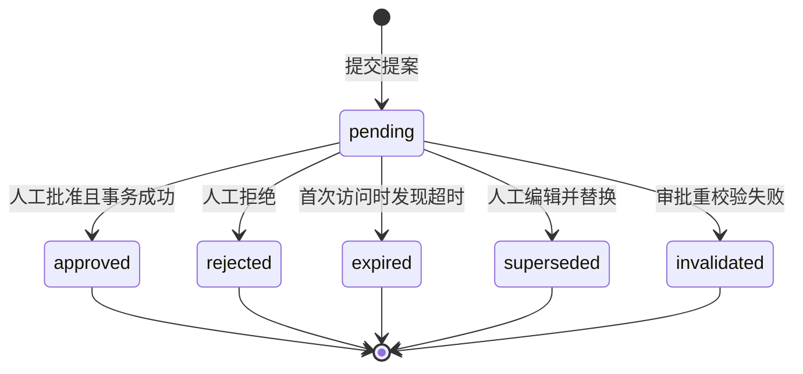

# Returns Desk RMA 状态机设计

## 1. 文档目的

本文定义 RMA 提案、人工审批和模拟执行过程中的状态、转换、事务边界、并发控制、错误契约与审计要求。目标是保证 Agent 只能提交待审提案，正式 RMA 只能由人工批准创建，并防止重复审批、重复占用退货数量和部分执行。

本文中的 RMA 指 Return Merchandise Authorization。

## 2. 核心设计决策

- RMA 提案与正式 RMA 分离建模。
- Agent 只能创建 `pending` 提案，不能批准提案或直接创建正式 RMA。
- 提案状态为 `pending`、`approved`、`rejected`、`expired`、`superseded` 和 `invalidated`。
- 除 `pending` 外，其余提案状态均为终态，终态记录不能复活。
- 人工批准后立即完成模拟执行；正式 RMA 创建时状态直接为 `completed`，不设置 `processing` 阶段。
- 提案使用惰性过期：读取或审批入口发现超时后执行原子过期转换，MVP 不依赖定时任务。
- 业务事实变化导致提案不可批准时进入 `invalidated`，不借用 `expired` 或 `superseded` 表达。
- 是否生成退货标签由提案审批快照中的 `return_required` 决定，与解决方案类型解耦。
- 换货批准时原子扣减库存，并创建状态为 `committed` 的库存预留记录。
- 同一 Case 已有 `pending` 提案时，Agent 提交不同提案返回冲突；只有人工 UI 的明确编辑操作可以替换待审提案。

## 3. 组件与职责

### 3.1 `RmaProposalService`

负责：

- 根据有效资格检查提交提案；
- 处理提交幂等性；
- 检测同一 Case 的待审提案冲突；
- 人工拒绝提案；
- 人工编辑并替换提案；
- 在读取入口执行惰性过期。

该服务不能创建正式 RMA 或执行库存、退款、余额和标签副作用。

### 3.2 `RmaApprovalService`

负责唯一的人工批准入口：

- 验证人工操作者和 Demo Session 边界；
- 处理过期状态；
- 重新校验资格、数量、金额、方案和换货库存；
- 在业务事实变化时使提案失效；
- 在单一事务中创建正式 RMA、模拟执行记录和审计事件；
- 对重复批准返回已有正式 RMA。

该服务不暴露为 Agent 或 WebMCP 工具，只允许明确的人类 UI 操作调用。

### 3.3 Repository Layer

Repository Layer 负责所有带 `session_id` 的隔离查询、条件更新、唯一约束和事务操作。UI 与 WebMCP 工具不能直接访问 Cloudflare D1。

## 4. 提案状态机



只有 `pending` 可以发生状态转换。对已处于 `approved` 的提案重复执行批准属于幂等结果读取，不是新的状态转换。

## 5. 状态转换表

| 操作 | 起始状态 | 目标状态 | 操作者 | 前置条件 | 成功动作 | 失败结果 |
|---|---|---|---|---|---|---|
| 提交提案 | 无 | `pending` | Agent 或人工 | 资格检查有效；方案被允许；数量、金额及方案字段合法；Case 无其他 `pending` 提案 | 保存完整审批快照和提交审计事件 | 相同幂等请求返回原提案；幂等键载荷不同或已有不同待审提案时返回冲突 |
| 人工批准 | `pending` | `approved` | 人工 | 未过期；重新校验通过；剩余可退数量足够；换货库存足够 | 创建并完成正式 RMA，产生对应模拟记录并写审计事件 | 业务重校验失败进入 `invalidated`；技术失败全部回滚并保持 `pending` |
| 人工拒绝 | `pending` | `rejected` | 人工 | 原因码合法 | 保存复核人、复核时间、原因并写审计事件 | 状态已改变时返回当前终态 |
| 惰性过期 | `pending` | `expired` | 系统 | 当前时间大于或等于 `expires_at` | 原子更新状态并写审计事件 | 并发请求未取得转换权时读取并返回最终状态 |
| 编辑替换 | `pending` | `superseded` | 人工 | 新提案校验通过 | 在同一事务中终结旧提案、创建新 `pending` 提案并互相关联 | 任一步失败则不改变旧提案 |
| 审批失效 | `pending` | `invalidated` | 系统代人工审批流程 | 资格检查失效、数量不足、方案不再允许或换货库存不足 | 保存结构化失效原因并写审计事件 | 数据库或其他技术错误回滚，提案保持 `pending` |

`rejected`、`expired`、`superseded` 或 `invalidated` 后若仍需处理，必须重新执行资格检查并创建新提案。

## 6. 提交、替换与过期规则

### 6.1 提交幂等性

- 客户端必须提供 `idempotency_key`。
- 服务端保存规范化请求载荷的哈希。
- 相同幂等键且载荷哈希相同时，返回原提案。
- 相同幂等键但载荷哈希不同时，返回 `IDEMPOTENCY_KEY_REUSED`。
- 同一 Case 已有不同的 `pending` 提案时，Agent 请求返回 `PENDING_PROPOSAL_CONFLICT`，不得静默覆盖或复用不同内容。

### 6.2 人工编辑替换

人工 UI 的“编辑并替换”是显式操作。它在一个事务中：

1. 校验旧提案仍为 `pending`；
2. 校验新提案载荷；
3. 创建新的 `pending` 提案；
4. 把旧提案更新为 `superseded`；
5. 设置旧提案的 `superseded_by_proposal_id`；
6. 写入旧提案被替代和新提案被提交的审计事件。

任一步失败时，旧提案仍保持 `pending`。

### 6.3 惰性过期

所有提案读取和审批入口先检查 `expires_at`。若 `status = pending` 且当前 UTC 时间大于或等于 `expires_at`，使用条件更新将其改为 `expired`。首次成功转换的请求写入 `rma_proposal.expired`；其他并发请求只读取最终状态，不重复写事件。

## 7. 人工批准事务

人工批准按以下顺序在一个数据库事务中执行：

1. 按 `session_id` 和提案 ID 读取提案，验证人工操作者权限。
2. 处理惰性过期；过期提案提交 `expired` 转换后结束，不进入执行阶段。
3. 确认提案仍为 `pending`。若已为 `approved`，读取并返回其现有正式 RMA；其他终态返回不可批准错误。
4. 重新校验资格检查是否有效、方案是否仍被允许、金额是否一致、请求数量是否仍可退，以及换货目标 Variant 是否有效且库存充足。
5. 重校验失败时将提案更新为 `invalidated`，保存结构化原因并写审计事件；提交该失效结果，但不创建正式 RMA 或任何执行记录。
6. 以条件更新方式增加 `order_items.previously_returned_quantity`，条件必须保证更新后不超过 `fulfilled_quantity`。
7. 创建唯一的正式 `rmas` 记录和对应 `rma_items`，RMA 状态设置为 `completed`，同时设置 `created_at` 和 `completed_at`。
8. 按解决方案创建对应的唯一模拟执行记录。
9. 当审批快照中的 `return_required = true` 时，创建唯一模拟退货标签。
10. 把提案更新为 `approved`，保存 `reviewed_at` 和 `reviewed_by`。
11. 写入批准、正式 RMA 和全部执行结果的审计事件。
12. 提交事务。

任何数据库、超时或内部技术错误都回滚整个事务，提案保持 `pending`。系统不能产生库存已扣但 RMA 不存在、提案已批准但退款记录缺失等部分成功。

## 8. 解决方案副作用

### 8.1 换货 `exchange`

- 使用条件更新原子扣减目标 Variant 的 `inventory_quantity`；条件保证库存不会变为负数。
- 创建一条与 RMA 关联、状态为 `committed` 的 `inventory_reservations` 记录。
- 不创建模拟退款或商店余额。

库存预留记录是换货库存落账的审计凭证；由于 RMA 立即模拟完成，不保留活动中的库存锁定状态。

### 8.2 原路退款 `refund`

- 创建一条与 RMA 关联的 `simulated_refunds` 记录。
- 不修改换货库存，不创建商店余额。

### 8.3 商店余额 `store_credit`

- 创建一条与 RMA 关联的 `store_credits` 记录。
- 不修改换货库存，不创建模拟退款。

### 8.4 退货标签

- `return_required = true` 时创建一条与 RMA 关联的 `return_labels` 记录。
- `return_required = false` 时不得创建标签。
- 标签规则不根据 `exchange`、`refund` 或 `store_credit` 硬编码判断。

## 9. 并发与数据库约束

所有状态转换使用包含预期状态的条件更新，例如：

```sql
UPDATE rma_proposals
SET status = :next_status
WHERE id = :id
  AND session_id = :session_id
  AND status = 'pending';
```

若影响行数为零，服务读取当前状态并按幂等规则或非法转换规则返回。两个并发批准请求最多只有一个能够创建正式 RMA；后到请求若读取到 `approved`，返回第一次批准创建的 RMA。

数据库必须提供以下约束：

- `rma_proposals(idempotency_key)` 唯一；
- 同一 Case 同时最多存在一个 `pending` 提案，使用 SQLite 支持的部分唯一索引实现；
- `rmas(proposal_id)` 唯一；
- `rmas(session_id, rma_number)` 唯一；
- 每类模拟执行记录的 `rma_id` 唯一；
- `inventory_reservations(rma_id)` 唯一；
- `return_labels(rma_id)` 唯一；
- 数量和金额非负；
- 方案专属字段符合 `resolution_type`。

## 10. 数据模型补充

`rma_proposals` 增加：

- `request_hash`：规范化提交载荷哈希；
- `return_required`：审批快照中的是否寄回标志；
- `rejection_reason_code`：人工拒绝原因；
- `invalidated_reason_code`：业务事实变化导致的失效原因；
- `review_note`：可选人工说明，按不可信内容处理；
- `superseded_by_proposal_id`：指向人工编辑创建的新提案。

`inventory_reservations` 至少包含 `status = committed`、目标 Variant、数量和创建时间。模拟退款、商店余额和退货标签记录均包含唯一模拟业务编号、`rma_id` 和 `created_at`。

正式 `rmas.status` 在 MVP 中只使用 `completed`。保留该字段是为了清晰查询和未来扩展，但不得预先实现未设计的处理中状态。

## 11. 审计事件映射

| 状态转换或动作 | 事件类型 | actor |
|---|---|---|
| 创建提案 | `rma_proposal.submitted` | `agent` 或 `human` |
| 人工拒绝 | `rma_proposal.rejected` | `human` |
| 惰性过期 | `rma_proposal.expired` | `system` |
| 人工编辑替换旧提案 | `rma_proposal.superseded` | `human` |
| 审批重校验失效 | `rma_proposal.invalidated` | `system` |
| 人工批准 | `rma_proposal.approved` | `human` |
| 创建正式 RMA | `rma.created` | `human` |
| 完成正式 RMA | `rma.completed` | `human` |
| 换货库存落账 | `inventory.committed` | `human` |
| 创建模拟退款 | `refund.simulated` | `human` |
| 创建商店余额 | `store_credit.created` | `human` |
| 创建退货标签 | `return_label.created` | `human` |

审计事件至少记录 `session_id`、Case ID、提案 ID、RMA ID、操作者、转换前后状态、结构化原因码、数量、金额和 SKU 等必要业务摘要。审计日志不保存完整客户消息、Agent 对话、浏览历史或其他非业务所需内容。

即使惰性过期由一次用户读取触发，过期事件的 `actor_type` 仍为 `system`，因为用户没有作出过期决策。

## 12. 错误契约

| 错误码 | 含义 | 可恢复方式 |
|---|---|---|
| `PENDING_PROPOSAL_CONFLICT` | Case 已有不同的待审提案 | 在 UI 查看、拒绝或显式编辑替换现有提案 |
| `IDEMPOTENCY_KEY_REUSED` | 同一幂等键对应不同请求内容 | 使用新幂等键重新提交 |
| `PROPOSAL_NOT_APPROVABLE` | 提案处于非 `pending` 终态 | 根据返回的当前状态决定是否重新检查资格 |
| `PROPOSAL_EXPIRED` | 审批或读取触发提案过期 | 重新检查资格并创建提案 |
| `PROPOSAL_INVALIDATED` | 审批重校验发现业务事实变化 | 根据结构化原因修正输入、重新检查资格并创建提案 |
| `ELIGIBILITY_CHECK_STALE` | 资格检查已过期或输入事实变化 | 重新执行资格检查 |
| `RETURN_QUANTITY_UNAVAILABLE` | 剩余可退数量不足 | 重新检查可退数量 |
| `EXCHANGE_INVENTORY_UNAVAILABLE` | 目标 SKU 库存不足 | 选择其他 SKU 或其他解决方案 |
| `INVALID_STATE_TRANSITION` | 请求的状态转换不允许 | 读取当前状态并停止重试该转换 |
| `APPROVAL_TRANSACTION_FAILED` | 技术失败且事务已回滚 | 使用同一批准请求安全重试 |

错误响应应包含稳定错误码、当前提案状态、可恢复建议和安全的关联 ID，不暴露数据库内部错误。

## 13. 测试矩阵

### 13.1 状态转换

- 验证 `pending` 到每个终态的合法转换。
- 验证所有终态不能再次转换。
- 验证已批准提案的重复批准返回原 RMA，不写入新记录。
- 验证拒绝、过期、替换或失效后的继续处理必须创建新提案。

### 13.2 幂等与并发

- 相同幂等键和相同载荷返回原提案。
- 相同幂等键和不同载荷返回 `IDEMPOTENCY_KEY_REUSED`。
- 同一 Case 已有待审提案时，Agent 的不同提交返回 `PENDING_PROPOSAL_CONFLICT`。
- 多个读取请求并发触发惰性过期时，只发生一次转换并只写一个过期事件。
- 两个人工请求并发批准时，只创建一个 RMA 和一组副作用。

### 13.3 业务重校验

- 资格检查过期、资格输入变化、方案不再允许、剩余数量不足和换货库存不足分别使提案进入 `invalidated`，并记录准确原因。
- 技术错误不会把提案错误地转为 `invalidated`。

### 13.4 执行副作用

- 三种解决方案只创建各自对应的执行记录。
- `return_required` 为真时创建标签，为假时不创建。
- 换货库存扣减数量与 `committed` 预留数量一致。
- 批准时只增加一次 `previously_returned_quantity`。
- 任一写入步骤注入失败时，提案、已退数量、库存、RMA、执行记录和审计事件全部回滚。

### 13.5 审计与隔离

- 每个转换和副作用都生成预期审计事件，并包含正确 actor、前后状态、原因和关联 ID。
- 惰性过期事件使用 `system` actor。
- 不同 Demo Session 无法读取、替换、拒绝或批准彼此的提案。
- 审计元数据不包含完整客户消息或 Agent 对话。

## 14. 验收标准

- 任何正式 RMA 都唯一追溯到一个人工批准的提案。
- 任何提案最多创建一个正式 RMA，并且只能批准一次。
- 任何已批准的退货数量只计入一次。
- 任何库存、退款、余额或标签副作用都与唯一正式 RMA 关联。
- Agent 无法绕过人工审批创建正式 RMA 或执行副作用。
- 并发、重试和技术失败不会产生重复记录或部分成功。
- 每个重要转换和执行动作都可以通过追加式审计日志解释。
