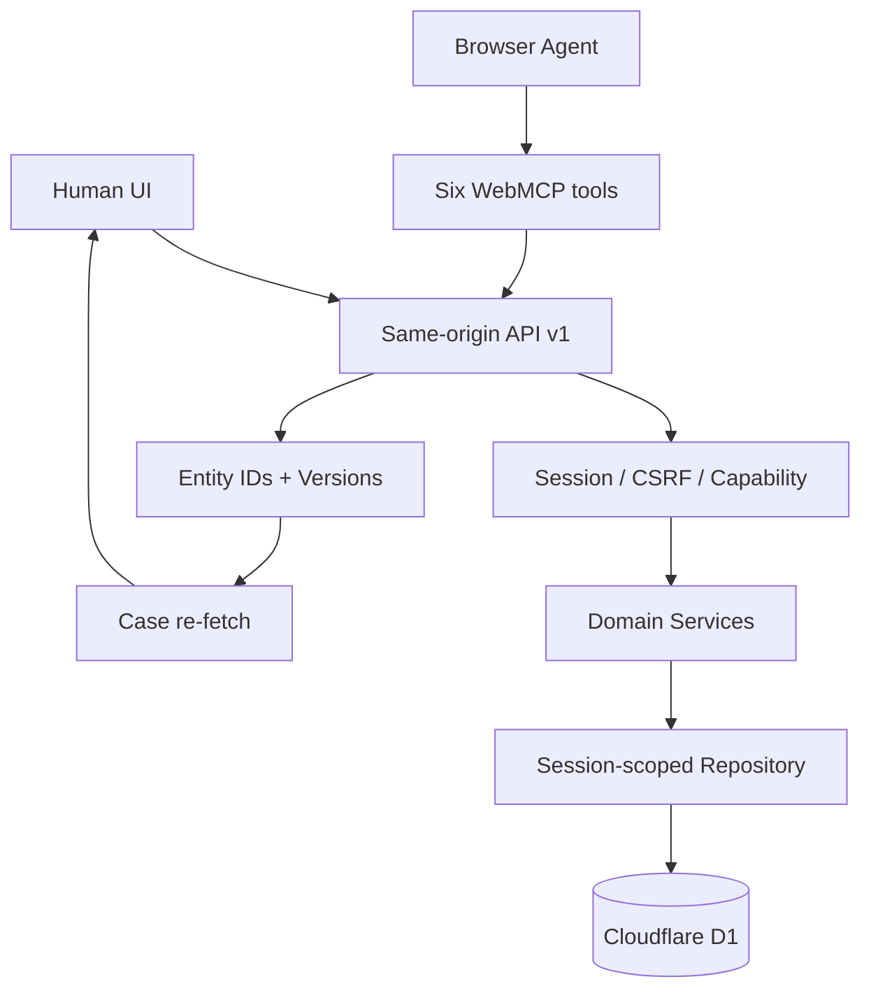
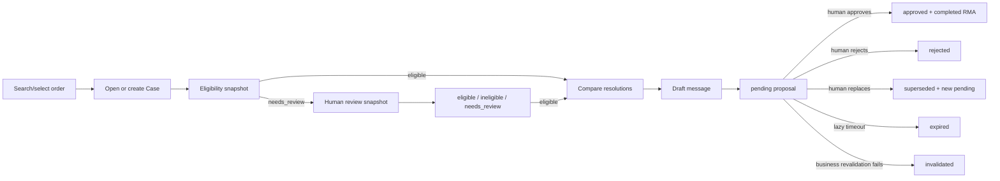

# Returns Desk 完整产品技术规格

## 1. 规格状态

本规格汇总并审核截至 2026-08-29 已确认的 Returns Desk MVP 设计。产品规则、状态、接口、页面、安全和测试均已有唯一明确决策；不存在 `TODO`、`TBD` 或未决定业务项。

WebMCP 是演进中的浏览器能力，其兼容性作为发布验证门槛处理，不改变领域规格。产品代码以 progressive enhancement 方式运行：没有 WebMCP 时人工 UI 仍完整可用。

## 2. 产品目标与范围

Returns Desk 是面向小型电商和独立卖家的 Agent-ready 退换货处理台。客服或浏览器 Agent 可以搜索订单、读取锁定政策、执行确定性资格判断、比较换货/退款/商店余额、生成模板消息并提交待审提案；只有人工可以复核资格、批准、拒绝或替换提案。

MVP 的库存、退款、余额、标签和 tracking number 均为 Session 隔离的模拟数据，不连接真实支付、物流、Shopify 凭证或生产客户数据。

明确不做：应用内 LLM、Agent 自动批准、真实资金/物流执行、自由脚本政策、跨 Session 数据、批量批准和正式 RMA processing 阶段。

## 3. 权威文档集

| 主题 | 权威文档 |
|---|---|
| 产品和组件边界 | 《总体架构》 |
| 关系模型、约束和生命周期 | 《数据模型》 |
| 政策层级、资格和解决方案 | 《政策规则与资格判定》 |
| 提案与正式 RMA 状态/事务 | 《RMA状态机》 |
| HTTP 与六工具逐项契约 | 《API与WebMCP详细契约》 |
| 页面、人工交互和同步 | 《页面与数据流》 |
| 威胁、测试、Eval 和 Demo | 《安全与测试设计》 |
| 交付依赖与阶段 | 《设计路线图》 |

若摘要与专题文档发生差异，以更具体的专题文档为准；任何修改必须同步更新本汇总的追踪表和一致性检查。

## 4. 不可变核心决策

1. 提案与正式 RMA 分离；Agent 只创建 `pending` 提案。
2. 提案状态为 `pending`、`approved`、`rejected`、`expired`、`superseded`、`invalidated`，只有 pending 可转换。
3. 提案惰性过期；业务事实变化在审批时进入 `invalidated`。
4. 人工批准事务创建正式 RMA 并立即设置 `completed`，没有 processing。
5. `return_required` 来自资格/审批快照并决定是否生成标签，与方案类型解耦。
6. 换货审批原子扣减库存并创建 `committed` 预留凭证。
7. 同一 Case 仅一个 pending 提案；Agent 冲突返回错误，仅人工编辑替换可以 supersede。
8. 只有有效 `eligible` 快照可提交提案；`needs_review` 必须人工生成新的不可变快照。
9. 订单行锁定下单时政策版本；政策由确定性代码按固定层级、priority 和稳定 ID 执行。
10. UI 与 WebMCP 调用同一 HTTP/领域服务，不复制业务规则。

## 5. 系统边界与数据流

领域服务是唯一授权、校验、政策和状态转换入口。浏览器不直接访问 D1；Repository 的每个业务查询包含 session_id；所有重要动作写追加式 audit_events。

## 6. 领域流程

批准事务重新校验资格、数量、金额、方案、库存和 seedVersion；任一技术失败全部回滚。业务失效只提交 invalidated 状态，不创建正式 RMA 或模拟副作用。

## 7. 政策与资格摘要

固定规则层级：硬性事实校验 → 强制拒绝 → 明确例外 → 政策调整 → 默认规则。同层级按 priority 降序和稳定 ID 升序；同优先级对同字段产生不同结果时返回 `needs_review/POLICY_RULE_CONFLICT`。

资格结果仅 `eligible`、`ineligible`、`needs_review`。快照保存输入哈希、政策版本、命中规则、金额、允许方案、库存事实、`return_required`、运费承担方和有效期。Agent 不能修改结论或自行添加方案。

## 8. RMA 与副作用摘要

批准只允许人工能力。在一个事务中：处理过期/终态 → 业务重校验 → 条件增加已退数量 → 创建唯一 completed RMA/RMA item → 按方案写模拟记录 → 按 `return_required` 写标签 → 更新提案 approved → 写审计。

- exchange：条件扣减目标 Variant 库存，创建 committed reservation；
- refund：创建 simulated refund；
- store_credit：创建 store credit；
- 三种方案都仅在 return_required 为 true 时创建 return label。

## 9. API 与 WebMCP 摘要

HTTP 基础路径 `/api/v1`，统一 success/error envelope、CSRF、Idempotency-Key、expectedVersion、expectedSeedVersion 和结构化 recoveryAction。

六工具及最终 annotations：

| 工具 | readOnly | untrusted | 结果 |
|---|---:|---:|---|
| search_orders | true | true | 最多 5 个安全订单摘要 |
| get_return_policy | true | false | 锁定政策摘要 |
| check_return_eligibility | false | true | Case/不可变资格快照 |
| compare_resolution_options | true | false | 已允许方案排序解释 |
| draft_customer_message | true | true | 未发送、未持久化纯文本草稿 |
| submit_rma_for_approval | false | true | pending 提案，无执行副作用 |

人工复核、批准、拒绝、替换、Reset 和政策编辑永远不注册为 WebMCP 工具。

## 10. 页面与人工控制摘要

主页面为 Dashboard、Orders、Case Workspace、Approval Queue、Policies。Case Workspace 是订单事实、资格、方案、消息、提案和 Activity 的统一工作台。

所有高风险人工动作显示结构化结果摘要和明确确认。非 pending 提案不显示批准按钮；needs_review 不显示提交提案；不可信客户/Agent 文本只按纯文本渲染。

写工具成功返回 Case 版本，客户端失效相关查询并重新读取到至少该版本。跨标签事件只提示刷新，服务端事实和 expectedVersion 保证正确性。

## 11. 安全摘要

- 高熵 HttpOnly、Secure、SameSite=Lax Session Cookie；Reset 后 CSRF 轮换。
- 写请求校验 CSRF 与 Origin；human 权限不能由客户端 actor 字段伪造。
- IDOR 使用 session_id repository scope 和统一 404。
- JSON Schema 之外再次验证实体关系、枚举、数量、金额、状态和长度。
- 客户文本与工具输出按不可信内容隔离；不渲染任意 HTML。
- 限流、超时、幂等、条件更新、唯一索引和事务覆盖滥用与并发。
- 日志不含 Cookie、token、完整邮箱、完整对话、系统提示或完整恶意内容。

## 12. WebMCP 兼容策略

- 主入口 `document.modelContext`；缺失时静默降级为纯 UI。
- Session bootstrap 后静态注册六工具；注册 controller abort 负责 cleanup。
- 执行 signal 传给 fetch，但取消为尽力而为；事务正确性不依赖 Chrome 是否传播 callback signal。
- headed Chrome 是原生契约和发布门槛；headless 只运行普通 API/UI/Schema 测试。
- Chrome/规范升级时重跑 `spikes/webmcp/` 探针。

## 13. 测试与发布门槛

测试分层：政策纯函数单元测试 → Repository/领域/D1 集成 → HTTP/WebMCP 契约 → UI 组件与可访问性 → Playwright E2E → Agent eval → 部署冒烟。

安全关键门槛全部必须通过：跨 Session、Agent 越权、Prompt Injection、双审批、库存最后一件、幂等重放、Reset 竞态、过期/失效、日志隐私和 CSRF/Origin。

三分钟主线：自然语言请求 → 搜索订单 → 锁定政策和资格 → 比较方案 → 草稿 → pending → 人工批准 → completed RMA 与模拟结果。目标 Chrome 和 ChatGPT in-app browser 各实测一次。

## 14. 完整性追踪审核

| 已确认需求 | 规格位置 | 验证证据 |
|---|---|---|
| 立即模拟完成 RMA | RMA状态机 §2/§7 | 事务与 E2E |
| 惰性过期 | RMA状态机 §6.3 | 并发集成 |
| invalidated 状态 | RMA状态机 §4/§7 | 业务失效用例 |
| return_required 决定标签 | 政策规则 §8；RMA状态机 §8.4 | 三方案标签矩阵 |
| 原子扣库存 + committed | RMA状态机 §8.1 | 最后一件库存竞态 |
| pending 冲突 | RMA状态机 §6.1 | API 409 契约 |
| 提案/正式 RMA 分离 | 数据模型 §9/§10 | FK/唯一约束 |
| 页面与人工安全边界 | 页面与数据流；安全与测试设计 | UI/E2E/越权测试 |
| 浏览器注册与 annotations | API与WebMCP详细契约 §2/§8/§11 | headed Chrome Spike |
| 生命周期和取消 | API与WebMCP详细契约 §2/§11 | abort/toolchange/幂等测试 |
| UI 同步 | API与WebMCP详细契约 §12 | entityVersion E2E |
| 逐工具 Schema 和错误 | API与WebMCP详细契约 §9/§13 | fixture/Schema 快照 |

## 15. 一致性审核结果

审核结论：规格可以由一个按依赖排序的实施计划覆盖，无需拆成独立产品。

已消除的矛盾：

- 资格检查会持久化 Case/快照，因此 annotations 从只读修正为写工具；
- 执行取消从强保证修正为尽力而为，正确性归于服务端事务和幂等；
- UI 同步明确使用服务端 entityVersion 重读，不依赖 toolchange 或跨标签内存事件；
- 正式 RMA 始终 completed，不存在 processing；库存记录始终 committed，不存在活动锁定/释放阶段。

已知外部风险只有 WebMCP draft/浏览器兼容变化，已有 progressive enhancement、headed 实测和重跑 Spike 门槛，不构成未决定设计项。

## 16. 规格验收条件

- 所有专题文档无占位符或互相冲突的状态、字段和权限。
- 六工具、HTTP 路由、错误码、annotations 和 UI 同步均可直接转为测试。
- 实施者不需要重新决定政策层级、RMA 状态、人工权限、事务边界或兼容策略。
- 用户审核并确认本规格后，进入实施计划，不直接开始编码。

