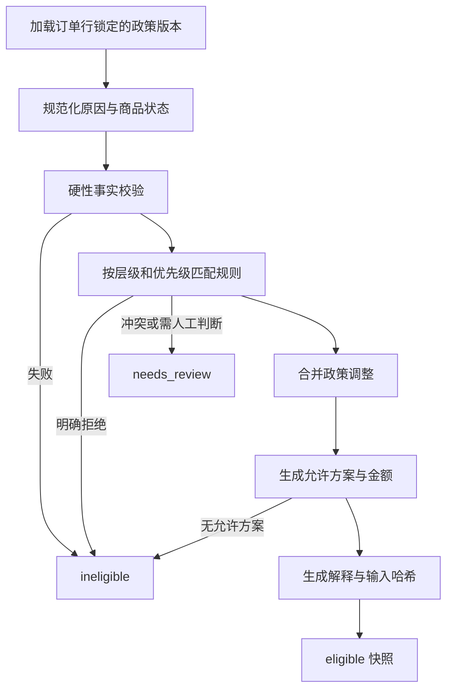

# Returns Desk 政策规则与资格判定设计

## 1. 文档目的

本文定义退换货政策的结构化表达、规则优先级、资格判定算法、人工复核边界、解决方案生成、快照失效和可解释输出。政策判断必须由确定性领域代码完成，Agent、页面和邮件生成器只能消费判定结果，不能自行解释或覆盖规则。

## 2. 核心决策

- 订单行锁定下单时适用的 `policy_version_id`，后续政策更新不追溯改变历史订单。
- 规则只能使用受支持的结构化条件和结果，不执行自由文本、脚本或 LLM 输出。
- 判定结果只有 `eligible`、`ineligible` 和 `needs_review`。
- 只有有效的 `eligible` 资格快照可以提交 RMA 提案。
- `needs_review` 不能被 Agent 自动转为可退；人工必须作出结构化复核决定并生成新的资格快照。
- 规则不只依赖数值 `priority`。系统先按固定规则层级执行，再在同一层级内按 `priority` 和稳定 ID 排序。
- 解决方案、金额、`return_required` 和解释均属于资格快照，不在提案或审批时由 Agent重新计算。
- 审批仍按最新业务事实重校验。输入事实变化时，原提案进入 `invalidated`，而不是静默采用新结果。

## 3. 判定输入

`EligibilityInput` 至少包含：

- `session_id`、Case ID、订单 ID、订单行 ID；
- 请求数量、原因码、商品状态码；
- 订单行锁定的政策版本；
- 下单、履约、送达和当前 UTC 时间；
- 商品类别、Final Sale 标志、允许的退货状态；
- 已履约数量、已退数量和剩余可退数量；
- 原支付金额、币种和可退金额上限；
- 可选目标换货 Variant、启用状态和当前库存；
- 客户是否明确同意商店余额；
- 此前人工复核结果（仅人工复核入口可提供）。

客户备注、商品标题和其他自由文本均为不可信展示内容，不能直接参与条件执行。原因和状态必须先映射到受支持的枚举码。

## 4. 规则层级与冲突算法

规则按照以下固定层级执行，前一层级的终止性结论优先于后一层级：

| 层级 | 目的 | 示例 | 是否可终止 |
|---|---|---|---|
| 1. 硬性事实校验 | 验证请求在数据上可处理 | 订单未送达、数量为零、超过剩余数量、币种不一致 | 是，返回 `ineligible` 或输入错误 |
| 2. 强制拒绝规则 | 应用不可覆盖的政策限制 | 超出绝对最长时限、不支持的商品状态 | 是，返回 `ineligible` |
| 3. 明确例外规则 | 处理损坏、错发、描述不符等例外 | Final Sale 商品损坏需人工复核 | 是，可返回 `eligible` 或 `needs_review` |
| 4. 政策调整规则 | 调整窗口、运费、方案或寄回要求 | 鞋类 30 天、低价值商品无需寄回 | 否，合并调整结果 |
| 5. 默认规则 | 填补没有被调整的政策结果 | 默认退货窗口和默认解决方案 | 形成最终结果 |

同一层级内：

1. `priority` 数值越高越先执行；
2. 同优先级按规则 ID 升序，保证重复计算结果稳定；
3. 两条终止性规则结论冲突时，不任意选一条，返回 `needs_review` 和 `POLICY_RULE_CONFLICT`；
4. 两条调整规则修改同一字段且值不同，以高优先级规则为准，并把被覆盖规则记录在解释证据中；
5. 同优先级调整规则修改同一字段且值不同，返回 `needs_review`，防止配置顺序意外改变业务结果。

## 5. 支持的规则目录

MVP 支持以下 `rule_type`：

| 规则类型 | 主要条件 | 主要结果 |
|---|---|---|
| `delivery_required` | 订单和送达状态 | 未送达不可退 |
| `quantity_limit` | 已履约、已退和请求数量 | 剩余可退数量 |
| `return_window` | 送达时间、当前时间 | 窗口天数和是否超期 |
| `category_window` | 商品类别 | 覆盖默认窗口 |
| `final_sale` | Final Sale 标志 | 一般原因不可退 |
| `condition_requirement` | 商品状态码 | 可退、不可退或需复核 |
| `reason_exception` | 原因码 | 损坏、错发、描述不符例外 |
| `resolution_allowlist` | 类别、原因、状态 | 允许的解决方案集合 |
| `return_shipping` | 原因、政策配置 | 商家或客户承担运费 |
| `return_required` | 类别、金额、原因 | 是否必须寄回 |
| `store_credit_bonus` | 政策和金额范围 | 商店余额奖励比例或固定额 |
| `manual_review` | 高风险组合 | 强制 `needs_review` |

政策编辑器只允许从该目录选择规则类型和字段。未知规则类型、未知字段或无效枚举使政策版本无法激活。

## 6. 标准判定流程



窗口按送达时间计算。`elapsed_days` 使用 UTC 日期边界和统一算法；当 `current_time < delivered_at` 时视为数据异常，不产生可退结论。

## 7. 关键业务规则

### 7.1 数量

请求数量必须大于零，且满足：

```text
requested_quantity <= fulfilled_quantity - previously_returned_quantity
```

剩余数量为零时返回 `ineligible` 和 `NO_RETURNABLE_QUANTITY`。审批事务再次使用条件更新验证该不变量。

### 7.2 窗口与 Final Sale

- 默认窗口来自订单行锁定的政策版本。
- 类别规则可以缩短或延长窗口，但不能超过系统配置的绝对最长时限。
- 在窗口最后一天结束前仍视为窗口内；所有快照保存精确 `window_ends_at`。
- Final Sale 对普通主观原因返回 `ineligible`。
- Final Sale 遇到 `damaged`、`wrong_item` 或 `not_as_described` 时进入明确例外规则；MVP 默认返回 `needs_review`，不得由 Agent 自动批准。

### 7.3 商品状态和原因

- 原因码：`changed_mind`、`wrong_size`、`damaged`、`wrong_item`、`not_as_described`。
- 状态码：`unopened`、`opened_unused`、`used`、`damaged`。
- 未知枚举返回输入错误，不映射为最相近值。
- 自相矛盾的组合，例如原因是 `changed_mind` 而状态是 `damaged`，返回 `needs_review` 和结构化原因。

## 8. 解决方案生成

只有整体结果为 `eligible` 时生成可提交方案：

| 方案 | 生成条件 | 金额/库存规则 | 提交约束 |
|---|---|---|---|
| `exchange` | 政策允许；目标 Variant 有效、启用且库存足够 | 记录目标 SKU、所需数量和判断时库存 | 审批时重新校验并原子扣减库存 |
| `refund` | 政策允许且存在可退金额 | 不超过该订单行剩余可退金额 | 审批时按快照金额创建模拟退款 |
| `store_credit` | 政策允许 | 基础金额加政策定义的奖励，结果取整到分 | 提交前必须有明确客户同意事实 |

至少一个方案可用才返回 `eligible`。库存不足只移除 `exchange`；若仍有退款或商店余额，整体资格不因此失效。`compare_resolution_options` 只能排序和解释快照中的方案，不能增加新方案或修改金额。

`return_required` 由命中的结构化政策规则计算，并随每个资格快照保存。没有命中覆盖规则时使用政策版本默认值。

## 9. 人工复核

当原检查为 `needs_review` 时，Approval Queue 不显示批准 RMA 操作，而显示“复核资格”。人工必须选择受支持的复核结果和原因码：

- `eligible_exception_approved`；
- `ineligible_exception_denied`；
- `insufficient_evidence`。

前两种结果创建新的不可变 `eligibility_checks` 快照，通过 `parent_check_id` 指向原检查，并设置 `review_source = human`、`reviewed_by` 和 `reviewed_at`。新快照重新计算允许方案、金额、寄回要求和有效期。`insufficient_evidence` 保持结果为 `needs_review`，不得提交提案。

人工复核不能修改订单数量、库存或政策版本；发现基础事实错误时应修正输入后重新运行普通资格检查。

## 10. 快照、缓存与失效

`input_hash` 对所有影响结论的规范化业务事实计算，包括订单行、政策版本、请求数量、原因、状态、目标 Variant 库存版本和人工复核来源。

资格快照在以下任一情况失效：

- 当前时间大于或等于 `expires_at`；
- 订单、订单行、已退数量或政策版本引用发生变化；
- 目标换货 Variant 的启用状态或库存版本变化；
- 请求数量、原因、商品状态、方案或客户同意事实与快照不一致；
- Demo Session 已重置或过期。

读取旧快照可以用于审计展示，但提交提案必须返回 `ELIGIBILITY_CHECK_STALE` 并要求重新计算。库存数量变化不必使退款方案失效，但只要提案选择了换货，就必须重新计算换货相关快照。

## 11. 输出契约与解释

资格输出至少包含：

- `eligibilityCheckId`、`status`、`expiresAt`；
- `policyVersionId` 和政策名称；
- `requestedQuantity`、`remainingReturnableQuantity`；
- `allowedResolutions`，含金额、目标 SKU 约束和客户同意要求；
- `returnRequired` 和退货运费承担方；
- `reasonCodes`；
- `matchedRules`，含规则 ID、层级、作用和人类可读解释；
- `missingInformation`；
- 安全的 `correlationId`。

解释模板只能插入经过编码的结构化值。客户文本不得拼接进政策解释或被当作操作指令。

## 12. 错误与原因码

| 代码 | 含义 |
|---|---|
| `ORDER_NOT_DELIVERED` | 订单尚未送达 |
| `NO_RETURNABLE_QUANTITY` | 没有剩余可退数量 |
| `RETURN_WINDOW_CLOSED` | 已超过退货窗口 |
| `FINAL_SALE_RESTRICTED` | Final Sale 普通原因不可退 |
| `CONDITION_NOT_ALLOWED` | 商品状态不符合政策 |
| `POLICY_RULE_CONFLICT` | 同层级规则产生无法自动解决的冲突 |
| `MANUAL_REVIEW_REQUIRED` | 必须由人工复核 |
| `CUSTOMER_CONSENT_REQUIRED` | 商店余额缺少明确客户同意 |
| `EXCHANGE_INVENTORY_UNAVAILABLE` | 换货目标库存不足 |
| `ELIGIBILITY_CHECK_STALE` | 快照过期或输入事实变化 |
| `INVALID_ELIGIBILITY_INPUT` | 输入枚举、数量、时间或关联关系无效 |

## 13. 验收标准

- 相同政策版本和相同规范化输入始终得到相同输出。
- 所有 `eligible`、`ineligible` 和 `needs_review` 结论均能追溯到输入快照与命中规则。
- Agent 无法创建、修改或覆盖政策结论，也无法把 `needs_review` 直接转为提案。
- 冲突规则不会因数据库返回顺序产生不同结论。
- 过期或事实变化的快照不能用于创建新提案。
- 所有允许方案、金额和 `return_required` 都由政策引擎产生并在审批时重校验。

