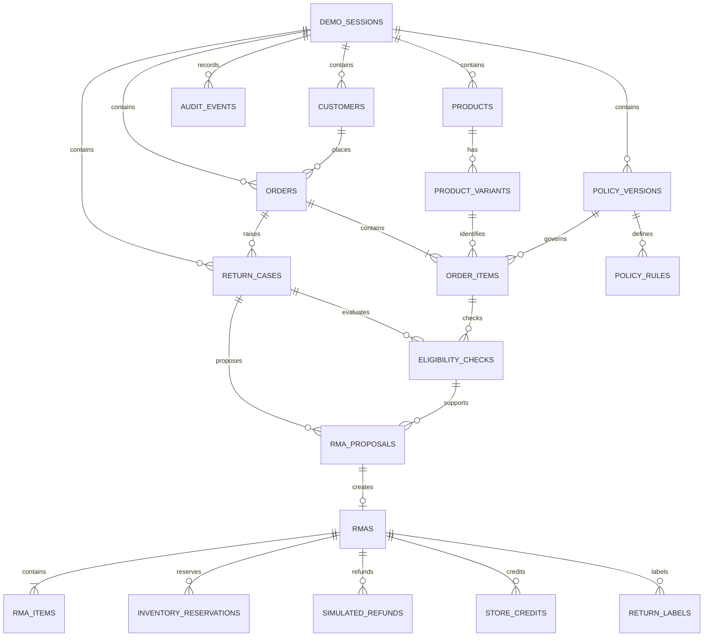
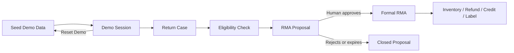

# Returns Desk 数据模型设计

## 1. 设计目标

Returns Desk 面向小型商家和客服人员，支持订单查询、退货政策匹配、资格判断、解决方案比较、RMA 提案审批和模拟执行。

数据模型采用以下原则：

- 使用关系表保存订单、库存、政策、RMA 等业务事实。
- 使用 JSON 快照保存资格判断时的输入、命中规则和计算证据。
- 数据库使用 Cloudflare D1（SQLite）。
- 金额统一使用整数分存储，时间统一使用 UTC。
- 所有 Demo 业务数据通过 `session_id` 隔离，避免不同评委相互影响。
- 订单行在下单时锁定政策版本；退货窗口从 `delivered_at` 开始计算。
- Agent 只能创建待审批的 RMA 提案，正式 RMA 必须由商家人工批准。
- 所有重要动作写入追加式审计日志。

## 2. 实体关系概览



## 3. Demo 会话

### `demo_sessions`

为每位匿名访客创建独立的 Demo 数据空间。

| 字段 | 说明 |
|---|---|
| `id` | 匿名会话 ID |
| `created_at` | 创建时间 |
| `expires_at` | 会话过期时间 |
| `seed_version` | Demo seed 数据版本 |
| `reset_count` | 当前会话被重置的次数 |

浏览器通过 HttpOnly Cookie 保存会话标识。首次访问时初始化 Demo 数据；“Reset Demo”只重建当前 `session_id` 下的数据。

## 4. 商品和库存

### `products`

- `id`
- `session_id`
- `title`
- `category`
- `final_sale`
- `returnable_condition`

### `product_variants`

- `id`
- `product_id`
- `sku`
- `title`
- `option_values_json`：尺码、颜色等选项
- `price_cents`
- `inventory_quantity`
- `inventory_version`：库存每次变化递增，用于快照失效和并发校验
- `active`

换货必须针对具体 Variant/SKU，而不是只针对 Product。

## 5. 客户和订单

### `customers`

- `id`
- `session_id`
- `name`
- `email_normalized`
- `locale`

### `orders`

- `id`
- `session_id`
- `order_number`
- `customer_id`
- `currency`
- `status`
- `ordered_at`
- `fulfilled_at`
- `delivered_at`

### `order_items`

- `id`
- `order_id`
- `variant_id`
- `quantity`
- `unit_price_cents`
- `fulfilled_quantity`
- `previously_returned_quantity`
- `policy_version_id`：下单时锁定的政策版本

可申请数量必须满足：

```text
requested_quantity <= fulfilled_quantity - previously_returned_quantity
```

## 6. 版本化退货政策

### `policy_versions`

- `id`
- `session_id`
- `version_number`
- `name`
- `effective_from`
- `effective_to`
- `default_window_days`
- `absolute_max_window_days`：任何类别或例外规则不得突破的最长窗口
- `default_return_required`：未命中覆盖规则时是否要求寄回
- `default_resolutions_json`：默认允许的解决方案集合
- `return_shipping_payer`：`merchant` 或 `customer`
- `status`：`draft`、`active` 或 `retired`
- `version`：draft 编辑和激活使用的乐观锁版本

### `policy_rules`

- `id`
- `policy_version_id`
- `rule_type`
- `priority`：数值越高越先执行
- `conditions_json`
- `outcome_json`
- `explanation_template`
- `active`

规则只允许使用预定义的结构化条件和结果，不保存或执行自由脚本。例如：

```json
{
  "ruleType": "category_window",
  "priority": 200,
  "conditions": { "category": "footwear" },
  "outcome": { "returnWindowDays": 30 }
}
```

## 7. Return Case

### `return_cases`

Return Case 是 Case Workspace 的业务锚点。

- `id`
- `session_id`
- `order_id`
- `customer_id`
- `status`
- `source`：`agent` 或 `manual`
- `reason_code`
- `condition_code`
- `customer_note`：按不可信内容处理
- `opened_at`
- `updated_at`
- `version`：Case 聚合每次可见业务变化递增，供 UI 同步和人工命令乐观锁使用

一个 Case 关联一个订单，可以对多个订单行执行资格检查；MVP 中每个 RMA 提案只处理一个订单行。

## 8. 资格检查

### `eligibility_checks`

- `id`
- `case_id`
- `order_item_id`
- `policy_version_id`
- `requested_quantity`
- `reason_code`
- `condition_code`
- `status`：`eligible`、`ineligible` 或 `needs_review`
- `allowed_resolutions_json`
- `return_required`
- `return_shipping_payer`
- `matched_rules_json`
- `calculation_snapshot_json`
- `input_hash`
- `parent_check_id`：人工复核快照指向原始 `needs_review` 检查
- `review_source`：`engine` 或 `human`
- `reviewed_by`：人工复核者；普通引擎检查为空
- `reviewed_at`：人工复核时间；普通引擎检查为空
- `created_at`
- `expires_at`

计算快照至少包含：

- 下单、履约、送达和判断日期；
- 送达后经过的天数；
- 商品类别、Final Sale 状态和 Variant；
- 已履约、已退和剩余可退数量；
- 判断时的换货库存；
- 命中的政策规则及人类可读解释。

提交 RMA 提案时必须引用仍有效的 `eligibility_check_id`。如果输入、政策相关事实或库存发生变化，必须重新检查。

只有 `eligible` 快照可以提交 RMA 提案。`needs_review` 必须由人工通过结构化原因作出复核决定，并创建新的不可变资格快照；Agent 不能直接覆盖原结论。

## 9. RMA 提案与人工审批

### `rma_proposals`

- `id`
- `case_id`
- `eligibility_check_id`
- `order_item_id`
- `resolution_type`：`exchange`、`refund` 或 `store_credit`
- `requested_quantity`
- `replacement_variant_id`
- `refund_amount_cents`
- `store_credit_cents`
- `merchant_cost_cents`
- `customer_message_json`
- `status`：`pending`、`approved`、`rejected`、`expired`、`superseded` 或 `invalidated`
- `idempotency_key`
- `request_hash`：规范化提交载荷哈希，用于校验幂等键是否被不同请求复用
- `return_required`：审批快照中的是否寄回标志
- `created_by`：`agent` 或 `human`
- `created_at`
- `expires_at`
- `reviewed_at`
- `reviewed_by`
- `rejection_reason_code`
- `invalidated_reason_code`
- `review_note`
- `superseded_by_proposal_id`
- `version`：状态变化和人工命令使用的乐观锁版本

`draft_customer_message` 本身不持久化；调用 `submit_rma_for_approval` 时，才将最终方案和邮件草稿一起保存为审批快照。

同一个 Case 同一时间只能有一个有效的 `pending` 提案。编辑方案时创建新提案，并把旧提案标记为 `superseded`，不覆盖历史记录。

## 10. 正式 RMA 和模拟执行结果

### `rmas`

- `id`
- `session_id`
- `rma_number`
- `case_id`
- `proposal_id`
- `resolution_type`
- `status`：MVP 只使用 `completed`，人工批准后立即完成模拟执行
- `created_at`
- `completed_at`

### `rma_items`

- `id`
- `rma_id`
- `order_item_id`
- `quantity`
- `replacement_variant_id`

人工批准后，根据最终方案创建对应的模拟执行记录：

- `inventory_reservations`：换货审批时原子扣减库存，并记录状态为 `committed` 的库存预留凭证；
- `simulated_refunds`：模拟原路退款；
- `store_credits`：模拟商店余额；
- `return_labels`：模拟退货标签和 tracking number。

这些记录必须关联正式 `rma_id`，不能由 Agent 工具直接创建。

## 11. 审计日志

### `audit_events`

- `id`
- `session_id`
- `case_id`
- `actor_type`：`agent`、`human` 或 `system`
- `actor_id`
- `event_type`
- `entity_type`
- `entity_id`
- `summary`
- `metadata_json`
- `created_at`

典型事件：

```text
order.searched
policy.read
eligibility.checked
resolutions.compared
message.drafted
rma_proposal.submitted
rma_proposal.approved
rma_proposal.rejected
inventory.committed
refund.simulated
store_credit.created
rma.created
demo.reset
```

审计日志不保存 Agent 的完整对话、浏览历史或跨网站上下文，只记录业务审计所需信息。

## 12. 关键约束与事务边界

- `orders(session_id, order_number)` 唯一。
- `rmas(session_id, rma_number)` 唯一。
- `rma_proposals(idempotency_key)` 唯一。
- 每个提案最多创建一个正式 RMA，并且只能批准一次。
- 数量必须大于 0，且不得超过剩余可退数量。
- 金额和库存不得为负数。
- `replacement_variant_id` 只允许用于 `exchange`。
- `refund_amount_cents` 只允许用于 `refund`。
- `store_credit_cents` 只允许用于 `store_credit`。
- 已拒绝、过期、被替代或因业务事实变化失效的提案不能再次批准。
- 人工复核快照必须引用同一 Case 下的父检查，且父检查状态为 `needs_review`。
- 审批、重新校验、创建 RMA 和创建模拟执行记录位于同一事务中。
- 换货库存使用条件更新或等价的原子校验，避免并发审批占用最后一件库存。
- 正式执行前重新检查资格有效期、剩余可退数量和目标 Variant 库存。
- 重校验发现业务事实变化时，提案进入 `invalidated`，且不创建正式 RMA 或模拟执行记录。
- 是否创建退货标签由提案快照中的 `return_required` 决定。

## 13. 数据生命周期



Demo Session 到期后可以按计划清理。比赛版本不使用真实客户、支付或物流数据；订单、退款、余额、标签和 tracking number 都是明确标识的模拟数据。

