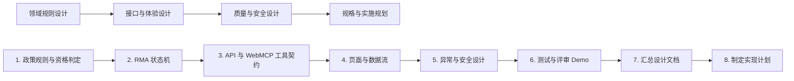

# Returns Desk 设计路线图

## 1. 文档目的

本文将数据模型确认后的八项设计与交付工作分为四个阶段，明确各项工作的目标、主要产出和依赖关系。实施代码应在完整设计规格确认并生成实施计划后开始。

## 2. 总体顺序



---

## 3. 第一阶段：领域规则设计

这一阶段回答“系统应该如何作出业务决定，以及业务对象如何改变状态”。它是后续接口、页面和测试设计的基础。

### 1. 政策规则与资格判定

#### 目标

建立确定性、可解释、可测试的退换货资格判定引擎，避免由 Agent 或 LLM 自由解释政策。

#### 主要设计内容

- 支持的规则类型；
- 规则优先级；
- 多条规则同时命中时的冲突处理；
- `eligible`、`ineligible` 和 `needs_review` 的判定条件；
- 退货窗口、商品类别、Final Sale、商品状态和已退数量等规则；
- 损坏、描述不符等例外处理；
- 换货、退款、商店余额三种解决方案的生成条件；
- 命中规则和判定原因的可解释输出；
- 资格检查的失效与重新计算条件。

#### 主要产出

- 政策规则目录；
- 规则优先级表；
- 冲突处理算法；
- 资格判定流程图；
- 解决方案生成规则；
- 判定输入与输出示例。

### 2. RMA 状态机

#### 目标

明确 Agent 提交提案、人类审批以及模拟执行过程中允许发生的状态变化，防止重复审批和非法跳转。

#### 主要设计内容

- RMA 提案的 `pending`、`approved`、`rejected`、`expired`、`superseded` 和 `invalidated` 状态；
- 正式 RMA 在 MVP 中由人工批准事务创建并立即进入 `completed`；
- 人工批准前后的业务边界；
- 换货库存的原子扣减与 `committed` 预留凭证；
- 模拟退款、商店余额和退货标签的创建时机；
- 提案过期、编辑、拒绝和重试规则；
- 并发审批和幂等处理；
- 每次状态转换产生的审计事件。

#### 主要产出

- RMA 状态图；
- 状态转换表；
- 每个转换的前置条件、执行动作和失败结果；
- 人工审批事务边界；
- 审计事件映射。

---

## 4. 第二阶段：接口与体验设计

这一阶段把领域能力转换为 Agent 和客服人员都能稳定使用的接口与页面。

### 3. API 与 WebMCP 工具契约

#### 目标

为前端和 WebMCP 工具建立一致的服务契约，确保 UI 与 Agent 调用同一套领域逻辑。

#### 主要设计内容

- 六个核心工具的输入 JSON Schema；
- 结构化输出格式；
- 业务错误码和可恢复错误信息；
- 只读与写入权限边界；
- `readOnlyHint` 和 `untrustedContentHint`；
- 幂等键和重复调用行为；
- `AbortSignal` 与取消处理；
- 工具结果长度控制；
- API 与 WebMCP 工具的领域服务映射。

#### 六个核心工具

1. `search_orders`
2. `get_return_policy`
3. `check_return_eligibility`
4. `compare_resolution_options`
5. `draft_customer_message`
6. `submit_rma_for_approval`

#### 主要产出

- 工具契约文档；
- API 路由清单；
- 输入输出示例；
- 错误码表；
- 工具注册与生命周期说明。

### 4. 页面与数据流

#### 目标

设计完整的客服处理体验，并让 Agent 的每次操作都能在网页界面中得到可见反馈。

#### 主要页面

- Dashboard；
- Orders；
- Case Workspace；
- Approval Queue；
- Policies。

#### 主要设计内容

- 页面职责和导航关系；
- Case Workspace 的订单、资格、方案、邮件和时间线布局；
- WebMCP 工具执行后的界面同步；
- 加载、空数据、失败和重试状态；
- 人工批准、编辑和拒绝操作；
- Demo Session 和 Reset Demo 的交互；
- Agent Activity 时间线展示。

#### 主要产出

- 信息架构；
- 页面流程图；
- 页面状态模型；
- UI 与领域事件映射；
- 关键交互说明。

---

## 5. 第三阶段：质量与安全设计

这一阶段确保项目不仅能够演示，还能在评委重复测试、异常输入和并发操作下稳定运行。

### 5. 异常与安全设计

#### 目标

定义系统的信任边界和异常恢复行为，保护订单、库存、审批和会话数据。

#### 主要设计内容

- 换货库存发生变化时重新校验；
- 重复提交和重复审批保护；
- 资格检查过期或输入变化后的失效；
- Prompt Injection 与不可信客户内容；
- JSON Schema 之外的服务端严格验证；
- Demo Session 数据隔离；
- Cookie、CSRF 和人工审批保护；
- Reset Demo 的作用范围；
- 审计日志的隐私最小化；
- API 超时、取消、限流和结构化失败结果。

#### 主要产出

- 威胁模型；
- 信任边界图；
- 异常场景矩阵；
- 安全控制清单；
- 幂等和事务策略。

### 6. 测试与评审 Demo

#### 目标

建立可重复验证的测试体系，并确保三分钟内清楚展示完整的 WebMCP 人机协作闭环。

#### 测试范围

- 政策引擎单元测试矩阵；
- 状态机和事务测试；
- API 集成测试；
- WebMCP 工具契约测试；
- Agent 自然语言 eval；
- Prompt Injection 和越权测试；
- Playwright 端到端测试；
- 启用 WebMCP 的 Chrome Canary 实测。

#### Demo 主线

```text
客服提出自然语言请求
→ Agent 搜索订单
→ 查询政策并判断资格
→ 比较换货、退款和商店余额
→ 生成客户邮件
→ 提交 RMA 待审批
→ 人工批准
→ 创建正式 RMA 和模拟执行结果
```

#### 主要产出

- 测试矩阵；
- Agent eval 用例集；
- 端到端验收场景；
- 少于三分钟的 Demo 脚本；
- 发布前评审检查表。

---

## 6. 第四阶段：规格与实施规划

这一阶段把已确认设计整理成单一事实来源，并转化为可执行的开发任务。

### 7. 汇总设计文档

#### 目标

将所有已确认设计整理成完整且无矛盾的产品技术规格，供最终审核和实现使用。

#### 汇总范围

- 产品目标与范围；
- 总体架构；
- 数据模型；
- 政策规则和资格判定；
- RMA 状态机；
- API 与 WebMCP 工具契约；
- 页面和数据流；
- 异常、安全与隐私；
- 测试策略；
- 部署和比赛提交要求。

#### 完成条件

- 没有 `TODO`、`TBD` 或未决定项；
- 各文档中的字段、状态和工具名称一致；
- 范围足够聚焦，可由一个实施计划覆盖；
- 用户完成最终审核并明确批准。

### 8. 制定实现计划

#### 目标

将设计规格拆分为按依赖排序、可验证、可逐步提交的开发任务。

#### 计划应包含

- 每项任务涉及的具体文件；
- 先写的失败测试；
- 最小实现步骤；
- 每步验证命令；
- 验收条件；
- 建议的 Git 提交边界；
- Cloudflare D1 migration、部署和 Demo 数据初始化顺序；
- README、许可证、公开仓库、演示视频和 Devpost 文案等提交物。

#### 完成条件

- 所有任务都有明确输入、输出和验收方式；
- 依赖顺序清楚；
- 实施者无需重新决定产品和架构问题；
- 产品代码、测试、部署和比赛材料均被纳入计划。

## 7. 推荐执行检查点

每完成一个阶段，都应先确认阶段产出再进入下一阶段：

1. 领域规则确认；
2. 接口与体验确认；
3. 质量与安全确认；
4. 完整规格确认；
5. 实施计划确认；
6. 开始编码。

## 8. 已完成设计产出

- 政策规则与资格判定：见《政策规则与资格判定》。
- RMA 状态机：见《RMA状态机》。
- 页面与数据流：见《页面与数据流》。
- 异常、安全、测试与评审 Demo：见《安全与测试设计》。
- API 与 WebMCP 逐工具 JSON Schema、路由、错误、生命周期和 UI 同步：见《API与WebMCP详细契约》。
- 最终汇总与一致性审核：见《完整规格》。

完整规格经用户最终审核后进入实施计划。
