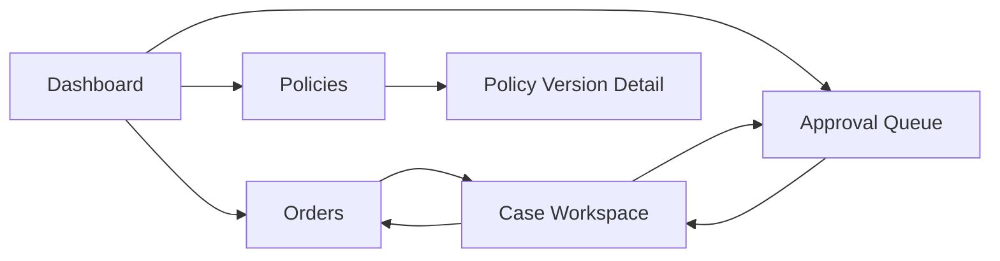
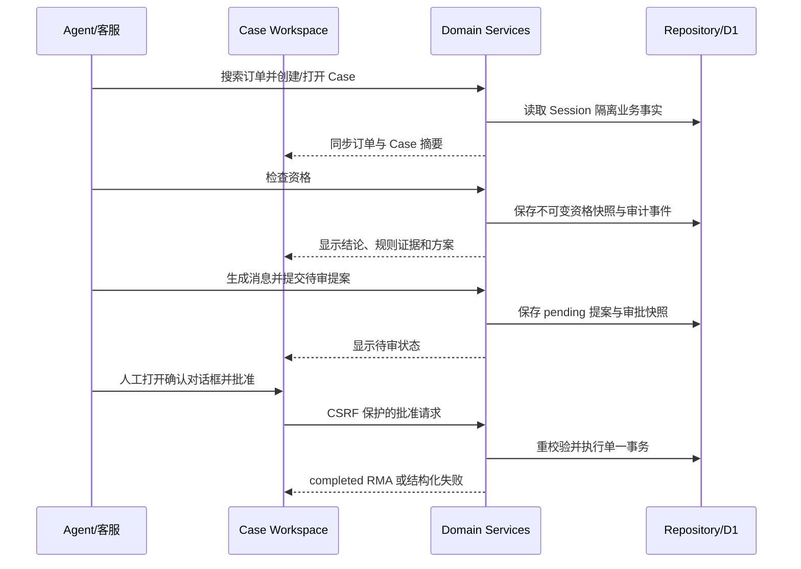

# Returns Desk 页面与数据流设计

## 1. 文档目的

本文定义客服人员使用 Returns Desk 的信息架构、页面职责、关键交互、页面状态，以及 WebMCP 工具、领域服务和 UI 之间的数据同步。目标是在一个可解释的人工工作台中展示 Agent 的每次业务动作，并确保批准等高风险操作只能由人类明确发起。

## 2. 体验原则

- Case Workspace 是单个售后请求的主工作台和事实来源。
- Agent 与 UI 调用相同领域服务，不复制政策或状态机逻辑。
- 页面根据服务端状态和领域事件刷新，不根据聊天文本猜测业务状态。
- 高风险动作使用明确动词、结果摘要和二次确认，不使用模糊的“继续”。
- 模拟退款、余额、库存和标签必须持续标记为 Demo，不造成真实执行预期。
- 客户备注和 Agent 生成内容按不可信内容显示，与系统提示和操作按钮视觉隔离。

## 3. 信息架构

全局导航固定包含 Dashboard、Orders、Approval Queue 和 Policies。当前 Demo Session 状态与 Reset Demo 入口放在全局壳层，不与业务批准按钮并列。

## 4. 页面职责

### 4.1 Dashboard

展示当前 Demo Session 的运营摘要：开放 Case、待审批提案、待人工资格复核、今日已完成 RMA 和异常数量。快捷入口只能导航到筛选后的列表，不直接执行批准或重置。

状态：

- 首次加载显示骨架屏；
- 无数据时说明 Demo 数据状态并提供“查看订单”；
- 单个统计失败时显示局部错误和重试，不隐藏其他可用统计；
- Session 失效时统一进入重新初始化流程。

### 4.2 Orders

支持按订单号、客户姓名或邮箱搜索，最多展示 5 个紧凑结果，并清楚显示匹配字段。多结果时必须由用户或 Agent 明确选择，不能默认打开第一条。

订单详情展示订单状态、送达日期、订单行、剩余可退数量和锁定政策版本。创建 Case 前要求选择订单行、数量、原因和商品状态；客户自由备注为可选不可信字段。

### 4.3 Case Workspace

页面分为五个稳定区域：

1. Case 标题栏：Case 状态、订单号、客户和安全的关联 ID；
2. 订单事实：订单行、数量、价格、送达时间、已退数量和政策版本；
3. 资格与方案：最新资格快照、命中规则、允许方案、金额、库存和 `return_required`；
4. 提案与客户消息：邮件草稿、待审提案和明确的人工操作；
5. Activity 时间线：Agent、人工和系统领域事件。

页面默认显示结构化摘要，规则证据和历史快照按需展开。展开内容仍由服务端结构化数据渲染，不渲染任意 HTML。

### 4.4 Approval Queue

队列分为两个视图：

- `RMA proposals`：当前有效的 `pending` 提案；
- `Eligibility reviews`：结果为 `needs_review` 且尚未形成后续人工快照的检查。

列表展示 Case、订单、客户、提案年龄、解决方案、金额、寄回要求、风险原因和过期时间。队列只支持筛选、排序和进入 Case Workspace，不提供一键批量批准。

### 4.5 Policies

展示政策版本、状态、生效时间、默认窗口和规则摘要。MVP 允许查看以及创建/编辑 `draft`，但 `active` 和 `retired` 版本不可原地修改。激活前执行结构校验、规则冲突预检和影响摘要确认。

历史订单继续显示并使用其锁定版本。政策页面不能修改单个资格快照或 RMA 结果。

## 5. Case Workspace 主流程

WebMCP 工具成功后，服务端返回受影响实体 ID 和版本。页面通过重新获取对应 Case 摘要或失效查询缓存显示结果；不依赖跨标签页内存事件作为唯一同步机制。

## 6. 页面状态模型

每个数据区域使用以下状态：`idle`、`loading`、`ready`、`empty`、`error` 和 `stale`。

- `loading` 保留已显示数据时使用局部进度，不整页闪白；
- `stale` 表示服务端版本已变化，禁用基于旧快照的提交按钮并触发刷新；
- 业务拒绝使用内联结构化提示，不当作网络错误 Toast；
- 网络或服务器错误保留用户输入，并提供安全重试；
- 提交期间禁用重复按钮，但正确性仍由服务端幂等和事务保证。

## 7. 人工资格复核交互

当最新检查为 `needs_review`：

- 页面突出显示触发原因、冲突规则和缺失信息；
- 隐藏“提交 RMA”动作；
- 人工选择受支持的复核结果与原因码，可添加短备注；
- 确认对话框声明将创建新的资格快照，不会创建 RMA 或执行退款；
- 成功后页面切换到新快照；若仍为 `needs_review`，继续禁止提交。

复核备注按不可信文本显示，不能改变结构化复核结果。

## 8. RMA 提案交互

### 8.1 提交

提交前摘要固定显示：订单行、数量、资格快照、方案、金额或目标 SKU、`return_required`、客户消息和提案有效期。若 Case 已有不同 `pending` 提案，Agent 收到 `PENDING_PROPOSAL_CONFLICT`，页面引导用户查看现有提案。

### 8.2 批准

批准只能从 Case Workspace 的提案详情发起。确认对话框显示即将产生的全部模拟副作用：正式 RMA、退款/余额/库存扣减以及是否生成标签。按钮文案为“批准并模拟完成 RMA”。

用户确认后提交唯一批准请求。成功页显示 RMA 编号和每个模拟结果；重复批准返回同一 RMA，不显示为第二次执行。

### 8.3 拒绝

拒绝要求选择结构化原因码，可填写可选备注。按钮文案明确为“拒绝提案”，成功后提案成为终态。

### 8.4 编辑并替换

人工从现有 `pending` 提案选择“编辑并替换”，修改受支持字段后查看差异摘要。确认后在一个事务中创建新提案并将旧提案标记为 `superseded`。UI 不提供原地覆盖。

### 8.5 过期与失效

读取触发惰性过期时，页面立即显示 `expired`，关闭审批动作并提供“重新检查资格”。审批重校验导致 `invalidated` 时，页面显示结构化原因和受影响事实，不提供原提案重试按钮。

## 9. Agent Activity 时间线

时间线只显示业务审计事件的安全摘要：

- 订单搜索和政策读取；
- 资格检查及结论；
- 方案比较和消息草稿生成；
- 提案提交、替换、拒绝、过期、失效和批准；
- RMA、库存、模拟退款、余额和标签结果；
- Demo Reset。

时间线不显示完整聊天、系统提示、浏览历史、Cookie、内部堆栈或客户敏感字段。事件使用服务端时间和 actor 类型，不接受客户端自报 actor。

## 10. Reset Demo

Reset Demo 使用独立危险操作对话框，说明只会重建当前 Session 的 Demo 数据并清除该 Session 下的 Case、快照、提案和模拟结果。用户必须输入或点击第二次明确确认。

请求携带 CSRF 令牌和幂等键。成功后轮换 Session 数据版本、清空客户端缓存并导航到 Dashboard。其他 Session 不受影响。Reset 与审批并发时使用 Session 级版本检查，避免旧请求写回新 seed。

## 11. 可访问性与响应式要求

- 所有状态不只靠颜色表达，提供文字和图标；
- 对话框具备焦点陷阱、Esc 行为和返回焦点；
- 表单错误与字段通过可访问描述关联；
- 时间线和规则证据可使用键盘展开；
- 关键流程在常见桌面宽度完整可用；移动端允许查看和处理，但批准摘要不得被折叠隐藏；
- 加载和结果变化通过适当的 live region 宣告。

## 12. UI 与领域事件映射

| UI 结果 | 领域事件 | 页面反应 |
|---|---|---|
| 资格检查完成 | `eligibility.checked` | 更新资格、方案和时间线 |
| 人工复核完成 | `eligibility.reviewed` | 切换到新快照 |
| 提案提交 | `rma_proposal.submitted` | 显示 pending 卡片和队列计数 |
| 提案替换 | `rma_proposal.superseded` | 显示差异和新提案 |
| 提案过期/失效 | `rma_proposal.expired` / `invalidated` | 禁用批准并显示恢复路径 |
| 批准成功 | `rma_proposal.approved`、`rma.completed` | 显示正式 RMA 与全部副作用 |
| Reset | `demo.reset` | 清缓存并返回新 Session Dashboard |

## 13. 验收标准

- Agent 执行工具后，相同 Case 页面能基于服务端事实显示最新结果。
- 所有批准、拒绝、资格复核和替换操作均需要人工明确确认。
- 任何非 `pending` 提案都不会显示可用批准按钮。
- `needs_review` 检查不能提交 RMA 提案。
- 业务冲突、过期、失效和技术错误各有不同且可恢复的页面反馈。
- 页面不执行自由 HTML，不把客户或 Agent 文本当作业务指令。
- 完整主线可在三分钟内从订单搜索走到 completed RMA。

